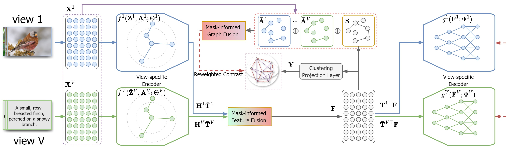

# 
`Mutual Structure Learning for Multiple Kernel Clustering (Under Review)`

> **Authors:**
Zhenglai Li, Yuqi Shi, Xiao He, Chang Tang

This repository contains simple pytorch implementation of our paper [Mask-IMvC](https://arxiv.org/pdf/2502.02234).

### 1. Overview

      

Illustration of mask-informed deep contrastive incomplete multi-view clustering (Mask-IMvC). The view-complete parts of IMvC data are first processed through their encoders to extract view-specific latent features. Next, a mask-informed fusion module aggregates the representations into a unified view-common one, which is then used to reconstruct the view complete parts of IMvC data via view-specific decoders. Finally, the prior knowledge from different views is fused via the mask-informed fusion strategy to assist the contrastive learning on the view-common representation.  

### 2. Usage
+ Prepare the multi-view clustering datasets and put them into ./datasets folder.

+ Prerequisites for Python:
    - Creating a virtual environment in the terminal: `conda create -n Mask-IMvC python=3.8`
    - Installing necessary packages: `pip install -r requirements.txt `

+ Train/Test
    - `sh train.sh`

### 3. Citation

Please cite our paper if you find the work useful:

    @article{li2025mask,
    title={Mask-informed Deep Contrastive Incomplete Multi-view Clustering},
    author={Li, Zhenglai and Shi, Yuqi and He, Xiao and Tang, Chang},
    journal={arXiv preprint arXiv:2502.02234},
    year={2025}
    }